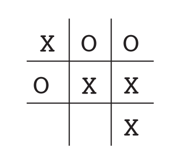

# Introduction

通过于环境进行交互来学习。

婴儿通过于环境的交互获得大量因果关系、动作的结果以及如何实现目标的信息。

**交互是环境和自身知识的主要来源**。

强化学习更**侧重于从交互中进行目标导向的学习**。

## 1.1 强化学习

​	==强化学习是一种学习如何将**状态映射到动作**，以获得**最大奖励**的学习机制==。学习者不会被告知要采取哪些动作，而是必须**通过尝试来发现哪些动作会产生最大回报**。动作不仅可以直接影响奖励，还能影响下一时刻状态，并影响到随后而来的奖励。

​	监督学习中，每一个样本都是一种情况的描述，都带有标签，而标签描述了系统在该情况下应该采取的正确动作。每一个样本都用来识别这种情况应该属于哪一类。**这种学习的目的是让系统推断概括它应有的反馈机制，使系统能够对位置样本作出正确的反应**。但是，它不是从交互中进行学习。

​	而在无监督学习中，通常是**寻找隐藏在未标记数据集合中的结构**。

​	==试错法和延迟奖励是强化学习两个最重要的可区别的特征==。

​	强化学习是第三种范式，既不是监督学习也不是无监督学习。它试图最大化奖励信号。强化学习也有其他类型学习中未出现的挑战——==如何平衡探索（Exploration）和利用（Exploition）之间的关系==。**为了获得大量奖励，强化学习的个体必须倾向于过去已经尝试过并且能够有效利益的行动。但是,为了发现这样的行动，它必须尝试以前没有选择过的行为**。而探索不一定带来正面效益。

​	强化学习有一个**完整的、交互式的、寻求目标（goal-seeking）**的个体。个体也是与大系统交互的一部分。在所有学习的方式中，强化学习是最接近动物的学习方式，且许多核心算法都受生物学习系统启发。

​	强化学习某种程度上符合人工智能回归简单的一般性原则的大趋势。基于特定知识的方法称为'"强方法"，基于一般性原则的方法称为“弱方法”。

## 1.2 举例

- 国际象棋大师落子。落子决定既通过规划 - 期待的回复和逆向回复 （anticipating possible replies and counterreplies），也出于对特定位置和移动及时直觉的判断。
- 自适应控制器实时调节炼油厂操作的参数。控制器在指定的边际成本的基础上优化产量/成本/质量交易，而不严格遵守工程师最初建议的设定。
- 一头瞪羚在出生后几分钟挣扎着站起来。半小时后，它能以每小时20英里的速度奔跑。
- 移动机器人决定是否应该进入新房间以寻找和收集更多垃圾来，或尝试回到充电站充电。 它根据电池的当前电池的充电水平，以及过去能够快速轻松地找到充电站的程度做出决定。
- 菲尔准备他的早餐。仔细检查，即使是这个看似平凡的行动，也会发现一个复杂的条件行为网和互锁的目标-子目标关系： 走到橱柜，打开它，选择一个麦片盒，然后伸手去拿，抓住并取回盒子。 拿到碗，勺子和牛奶盒也需要其他复杂的，调整的，交互的行为序列来完成。每个步骤都涉及一系列眼球运动，以获取信息并指导到达和移动。 它们需要对于如何拿住物品或者在拿其他物品之前将它们中的一些运送到餐桌上做出快速判断。 每个步骤都以目标为指导并为其他目标服务，例如抓起勺子或走到冰箱，比如一旦麦片准备好就拿勺子吃以最终获得营养。 无论他是否意识到这一点，菲尔都在获取有关他身体状况的信息，这些信息决定了他的营养需求，饥饿程度和食物偏好。

上面的例子的决策过程都涉及个体与环境的交互，**个体于不确定的环境中寻求如何实现目标**，个体的行为能够影响环境，从而影响个体之后可以获得的选择和机会。合适的选择需要考虑到动作的间接延后效应，因此需要预见（foresight）和规划。所有的例子中，**个体都可以使用与环境交互的经验来改善性能**。

## 1.3 强化学习的要素

==强化学习四要素：策略，奖励信号，价值函数，可选的关于环境的模型==。

- 策略（policy）:学习个体在给定时间内的行为方式。即**从感知环境状态到在这些状态下要采取的行动的（映射）**。对应于心理学中一组`刺激-反应`规则或关联。可以是函数、表格、搜索。是强化学习中个体的核心。策略一般是随机的。
- 奖励信号（reward signal）:定义了强化学习的目标。**个体的唯一目标是最大化长期总奖励**。奖励定义了个体所遇事件的好与坏。**奖励信号是改变策略的主要依据**。奖励信号一般是关于环境状态和动作的随机函数。
- 价值函数（value function）：没有奖励就没有价值，**估算**价值的唯一目的是获取更多汇报。然而，**在制定和评估决策是，我们最关心的是价值**。行动基于价值判断。奖励是立即性的判断，但是价值对应的是一种更精细、更高瞻远瞩的判断。
- 模型（model）：关于环境的模型，对环境的模拟。模型可以**预测下一个状态和下一个奖励**。model based方法和model free方法。model based方法用于规划，而model free方法通过试错进行学习。

## 1.4 局限性和范围

本书的大部分强化学习方法都是围绕**估计价值函数构建**的，但是它对于强化学习问题而言并不是必须的。**遗传算法，遗传规划，模拟退火等优化方法不需要价值函数**。

## 1.5 拓展例子：井字棋（Tic-Tac-Toe  ）

